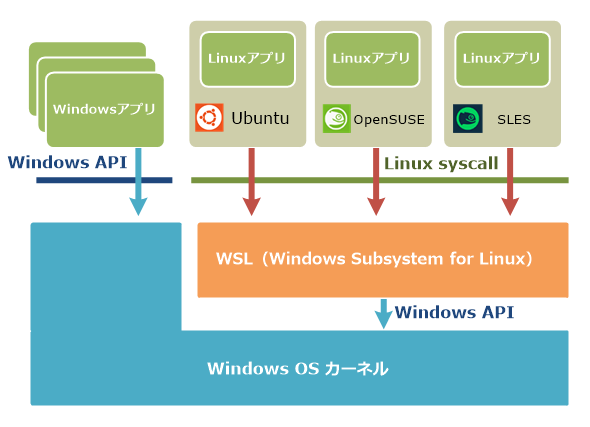

# begin_wsl
:beginner: はじめてのWSL

## WSL ?
* **W**indows **S**ubsystem for **L**inux （Windows で Linux が使える Microsoft 公式ソフト）
* イメージ
>  
>:link: http://www.atmarkit.co.jp/ait/articles/1608/08/news039.html  
>WSLはWindows OS上でLinuxの実行環境を実現するサブシステムである。Linuxのプログラムが発行したAPIやファイルアクセス要求などをWindows OSのAPIやファイルシステムアクセスなどに変換して、Linuxのバイナリプログラムをそのまま実行できるようにしている。Ubuntuの他、OpenSUSE、SLES（SUSE Linux Enterprise Server）などのディストリビューション向けのプログラムをそのまま実行できる。

* **Microsoft社のサポート権がつきます。（重要）**
>:link: [What's new in WSL in Windows 10 Fall Creators Update](https://blogs.msdn.microsoft.com/commandline/2017/10/11/whats-new-in-wsl-in-windows-10-fall-creators-update/)  
>This means that if you run into unexpected issues or problems with WSL, you can contact Microsoft Support to file a support ticket that will be managed through the normal channels.
* 市民権を得ている Ubuntu や 保守派にピッタリな Debian が使える。


## やること
**Ubuntu** か **Debian** を選んで Windows10 で動かす。

## インストール
参考：
* [Microsoft 本家マニュアル](https://docs.microsoft.com/en-us/windows/wsl/install-win10)
* [シス管系女子 - 漫画でわかるWSL](http://system-admin-girl.com/comic/begins/sp-wsl/)

長いので要約する。

### 1. WSL 機能を有効にする
* Windows Update を**最新**に。
* **PowerShell** を**管理者権限で**開き、以下を実行。
```
Enable-WindowsOptionalFeature -Online -FeatureName Microsoft-Windows-Subsystem-Linux
```
* 再起動。

### 2. OS を選んでインストール

:point_right: [Ubuntu にする](./ubuntu.md) / :point_right: [Debian にする](./debian.md)

